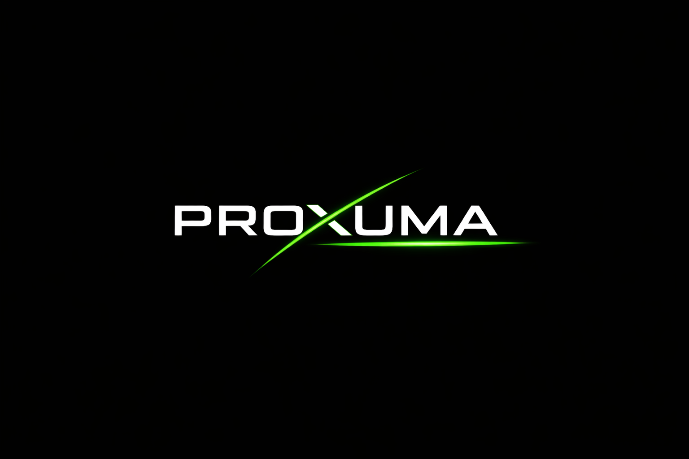
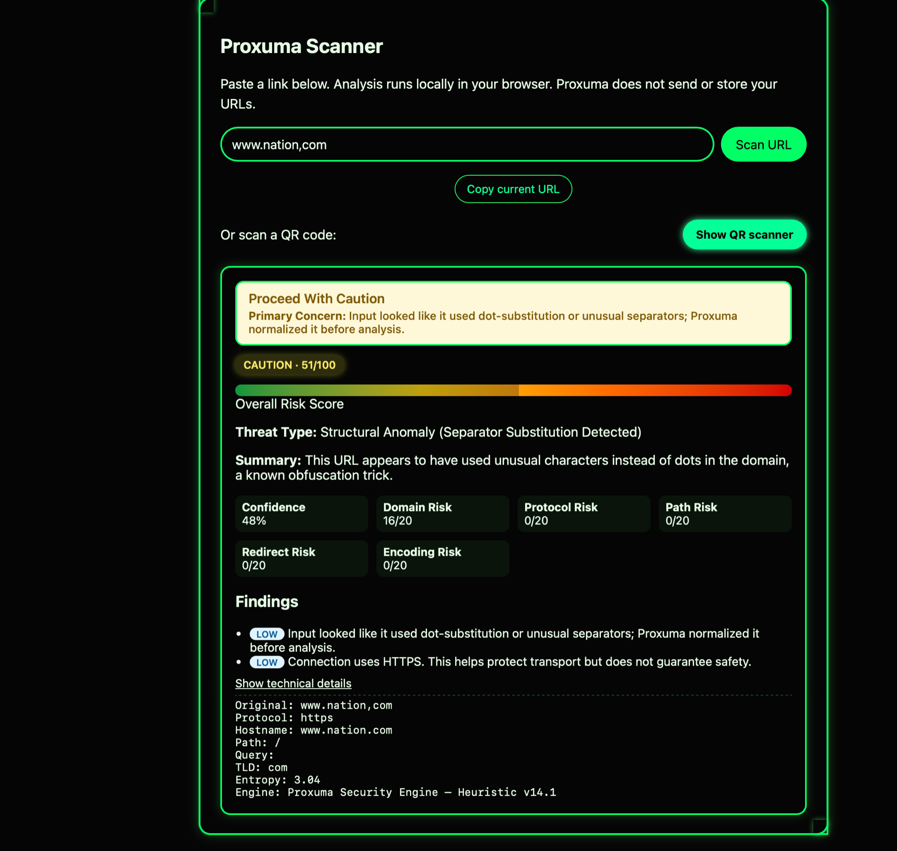
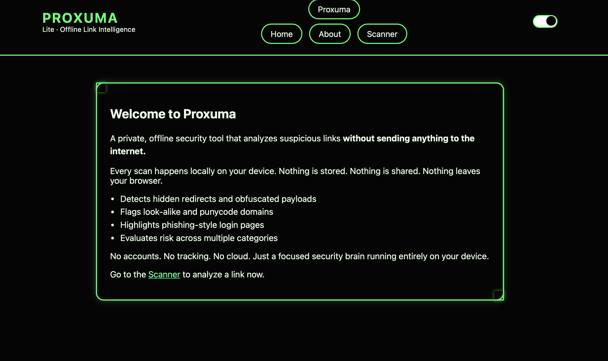

# 🛡️ Proxuma Lite

> **A privacy-first link scanner that analyzes URLs locally — no cloud, no tracking, no data leaving your device.**

⚡ Instant analysis — zero latency  
🔒 100% local processing  
🌐 **Live Demo:** https://proxuma-lite.vercel.app  

---

  

  

  

---

## 🔍 What is Proxuma Lite?

**Proxuma Lite is a local-first URL intelligence tool** that helps you evaluate links **before you trust them.**

It analyzes structure, patterns, and intent signals directly in your browser —  
without sending a single byte to external servers.

> No cloud. No logs. No surveillance.

---

## ⚙️ Core Capabilities

- Pre-click URL inspection  
- Instant analysis (no delays, no API calls)  
- Pattern-based threat detection  
- Phishing signal recognition  
- Risk scoring with explanations  
- Offline-first architecture  

---

## 🧪 Try It Yourself (Safe Demo)

Example URLs to test:

- http://secure-login-paypaI.com/verify  
- http://192.168.0.1/login?session=redirect  
- https://google.com.secure-authentication.co/login  

---

## 📊 How Risk Scoring Works

Proxuma Lite evaluates:

- Domain structure  
- Obfuscation patterns  
- Phishing indicators  
- TLD trust level  

Each contributes to a clear, human-readable risk score.

---

## 🔐 Privacy Model

> Your data never leaves your device. Period.

- No API calls  
- No tracking  
- No hidden requests  
- Fully client-side  

---

## ⚠️ Limitations

- Not a replacement for antivirus  
- No real-time threat databases  
- Cannot detect all threats  

---

## 🧭 Why Proxuma Lite Exists

Most tools send your data away and log behavior.

**Proxuma Lite flips that model.**

> You stay in control.

---

## 🧱 Architecture Philosophy

- Local-first  
- Transparent logic  
- Lightweight and fast  
- Built to evolve  

---

## 🔮 Roadmap

- Proxuma Shield (real-time protection)  
- Proxuma Sense (AI-assisted explanations)  
- Optional user-controlled threat feeds  
- Exportable reports  

---

## 📚 Documentation

👉 [View the Wiki](./wiki)

---

## 🤝 Contributing

Ideas and improvements are welcome.

---

## 📌 Final Note

### 🧭 Built for clarity. Designed for control.

> Know what you're clicking — before it knows you.

---
